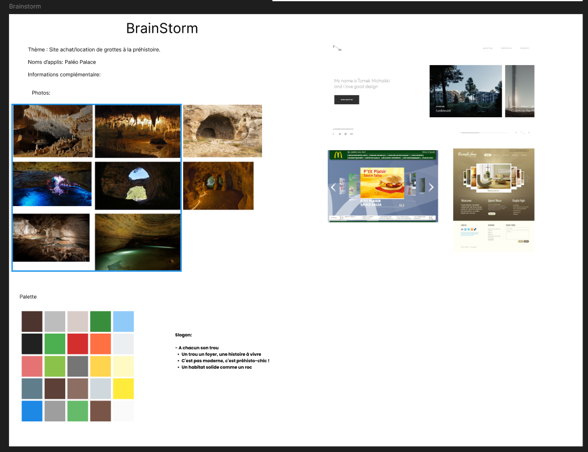
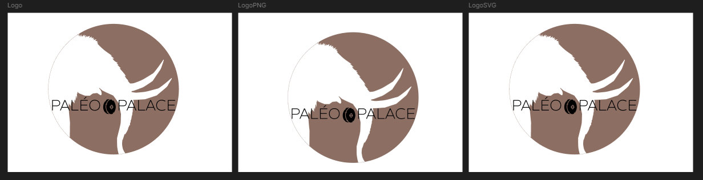

# 🪨 Palais Ô Palace 🐗

## 🏠 C'est pas moderne, c'est préhisto-chic ! ✨

### Description

Dans le cadre d'un **Hackathon**, nous avons réalisé un projet de la conception à la finalité en 24 heures, sur la vente immobilière de grottes au temps des hommes des cavernes. La valeur monétaire est en marcassinsmoutes et en sandwiches à la fraise. 🐗🥪🍓


## 📥 Installation

1. Clonez le dépôt :

   ```sh
   git clone git@github.com:dampherrr/PalaisOPalace.git
   ```

2. Installez les dépendances :

   ```sh
   npm install
   ```

3. Démarrez le client et le serveur :

   ```sh
   npm run dev
   ```

## 🛠️ Utilisation

Ouvrez votre navigateur et accédez à `http://localhost:3000`.

## 🗃️ Data

Nous avons utilisé le paquet NPM: `Papaparse` est utiliser l'URL (*Google Sheet*) comme API.

Voici le contenu:

- [Fichier CSV <br>](./client/src/divers/Grotte%20-%20Feuille%201.csv)


## 🖼️ Design

- [Fichier Figma <br>
](./client/src/divers/PalaisOPalace.fig)

- [Brainstorm <br>](./client/src/divers/Screen1.png)

- [Logo <br>](./client/src/divers/Screen2.png)

## 📂 Structure du projet

```java
PalaisOPalace/
├── client/
│   ├── src/
│   │   ├── assets/
│   │   │   ├── data/
│   │   │   │   └── datajs/
│   │   │   ├── Images/
│   │   │   │   └── Logo.svg
│   │   │   ├── media/
│   │   │   │   ├── icons/
│   │   │   │   │   ├── Logo.svg
│   │   │   │   │   └── moon.svg
│   │   │   │   ├── pictures/
│   │   │   │   │   ├── Background.jpg
│   │   │   │   │   ├── chasseur.png
│   │   │   │   │   ├── cloud1.png
│   │   │   │   │   ├── cloud2.png
│   │   │   │   │   ├── cloud3.png
│   │   │   │   │   ├── fire-torch-png.webp
│   │   │   │   │   ├── forest.png
│   │   │   │   │   ├── grotte.webp
│   │   │   │   │   ├── Logo.png
│   │   │   │   │   ├── LogoWithoutBack.png
│   │   │   │   │   └── marcassin.png
│   │   ├── components/
│   │   │   ├── AdvancedOptions.jsx
│   │   │   ├── Carrousel.jsx
│   │   │   ├── Navbar.jsx
│   │   │   └── Night.jsx
│   │   ├── context/
│   │   ├── divers/
│   │   │   ├── Grotte - Feuille 1.csv
│   │   │   ├── PalaisOPalace.fig
│   │   │   ├── Screen1.png
│   │   │   └── Screen2.png
│   │   ├── pages/
│   │   │   ├── Connexion.jsx
│   │   │   ├── Description.jsx
│   │   │   ├── Home.jsx
│   │   │   ├── Inscription.jsx
│   │   │   └── Search.jsx
│   │   ├── services/
│   │   │   └── request.js
│   │   ├── styles/
│   │   │   ├── advancedOptions.css
│   │   │   ├── home.css
│   │   │   ├── inscription.css
│   │   │   ├── navbar.css
│   │   │   ├── night.css
│   │   │   └── products.css
│   │   ├── App.css
│   │   ├── App.jsx
│   │   ├── index.html
│   │   └── main.jsx
│   ├── index.html
│   ├── package-lock.json
│   ├── package.json
│   └── vite.config.js
├── server/
│   ├── public/
│   │   ├── assets/
│   │   │   ├── data/
│   │   │   │   └── datajs/
│   │   │   ├── icons/
│   │   │   └── pictures/
│   ├── .env
│   ├── .env.sample
│   ├── index.js
│   ├── package-lock.json
│   └── package.json
├── .eslintrc.cjs
├── .gitignore
├── db.json
├── package-lock.json
├── package.json
└── README.md

```

## 📦 Paquets npm

### `/client`

- **[react-router-dom](https://www.npmjs.com/package/react-router-dom)** : Bibliothèque de routage pour React qui permet de gérer la navigation entre les différentes pages de l'application.
- **[axios](https://www.npmjs.com/package/axios)** : Client HTTP basé sur les promesses pour effectuer des requêtes vers des API externes ou internes.
- **[@tanstack/react-query](https://www.npmjs.com/package/@tanstack/react-query)** : Bibliothèque pour la gestion des états serveur, simplifiant le processus de fetch et de synchronisation des données.
- **[styled-components](https://www.npmjs.com/package/styled-components)** : Bibliothèque pour écrire des CSS dans vos composants JavaScript, offrant un style dynamique et modulaire.
- **[prop-types](https://www.npmjs.com/package/prop-types)** : Utilitaire pour vérifier les types des props passées aux composants, améliorant ainsi la robustesse et la maintenance du code.
- **[sass](https://www.npmjs.com/package/sass)** : Moteur de prétraitement CSS qui vous permet d'utiliser des fonctionnalités comme des variables, des imbrications et des mixins.
- **[Keen Slider](https://www.npmjs.com/package/keen-slider)** : Un puissant et flexible slider/carousel JavaScript sans dépendances, offrant des performances élevées et une personnalisation aisée pour une expérience utilisateur fluide sur toutes les plateformes.
- **[papaparse](https://www.npmjs.com/package/papaparse)** : Bibliothèque pour parser les fichiers CSV en JavaScript, facilitant l'importation et l'analyse de données CSV.

### `/server`

- **[express](https://www.npmjs.com/package/express)** : Framework web minimaliste et flexible pour Node.js, utilisé pour créer des applications web et des API robustes.
- **[json-server](https://www.npmjs.com/package/json-server)** : Serveur RESTful mock pour rapidement simuler une API avec un fichier JSON.
- **[cors](https://www.npmjs.com/package/cors)** : Middleware pour Express permettant de gérer les problèmes de sécurité liés aux politiques de partage de ressources entre origines multiples (CORS).
- **[dotenv](https://www.npmjs.com/package/dotenv)** : Module qui charge les variables d'environnement à partir d'un fichier `.env` pour les garder hors du code source.
- **[mongoose](https://www.npmjs.com/package/mongoose)** : Bibliothèque de modélisation d'objets pour MongoDB, facilitant l'interaction avec la base de données.
- **[body-parser](https://www.npmjs.com/package/body-parser)** : Middleware pour Express permettant d'analyser les corps des requêtes HTTP entrantes, supportant différents formats comme JSON.
- **[nodemon](https://www.npmjs.com/package/nodemon)** : Outil qui aide à développer des applications basées sur Node.js en redémarrant automatiquement le serveur lorsqu'un fichier change.
- **[concurrently](https://www.npmjs.com/package/concurrently)** : Utilitaire pour exécuter plusieurs commandes npm en parallèle.
- **[npm-run-all](https://www.npmjs.com/package/npm-run-all)** : Utilitaire pour exécuter plusieurs scripts npm en séquence ou en parallèle.

## ✍ Créateurs

- [antoinefouga <br>
](https://github.com/antoinefouga)  
- [Dampherrr <br>
](https://github.com/dampherrr)  
- [geoffpech <br>
](https://github.com/geoffpech)  
- [MathieuREY4 <br>
](https://github.com/MathieuREY4)  
- [PixelKata <br>
](https://github.com/PixelKata)  
  
---
